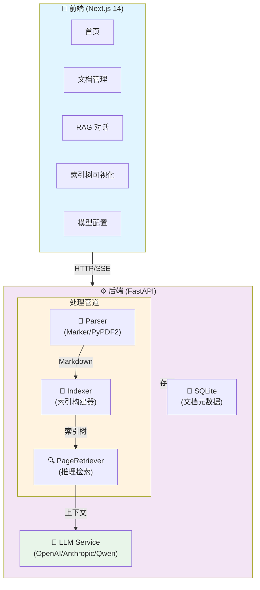

# DocMind — 推理式文档智能问答

<p align="center">
  
  
  
  
  
</p>

**中文 | [English](README_EN.md)**

> 🧠 **DocMind** — 智能文档问答系统，让 AI 像专家一样阅读文档。告别向量相似度，拥抱真正的相关性。

---

## ✨ 核心特性

| 特性 | 说明 |
|------|------|
| 🔮 **推理式检索** | 不依赖向量相似度，让 LLM 自主遍历索引树推理答案 |
| 📑 **Marker 高质量解析** | PDF → Markdown，保留标题层级、表格、公式、代码块 |
| 🌳 **智能索引树** | 自动从 Markdown 结构构建 ToC 树，模拟人读文档方式 |
| 💬 **RAG 对话** | 基于文档内容的精准问答，支持流式输出 |
| 🤖 **多模型支持** | OpenAI / Anthropic / Qwen / 本地模型，可配置 |
| 🎨 **深海洞穴主题** | Deep Ocean UI，沉浸式视觉体验 |

---

## 🏗️ 系统架构



---

## 📂 项目结构

```
docmind/
├── backend/                     # FastAPI 后端
│   ├── app/
│   │   ├── routers/            # API 路由
│   │   │   ├── documents.py    # 文档管理 API
│   │   │   └── chat.py        # RAG 对话 API
│   │   ├── services/          # 核心服务 ⭐
│   │   │   ├── parser.py      # 文档解析 (Marker / PyPDF2)
│   │   │   ├── indexer.py     # 索引构建
│   │   │   └── llm.py         # LLM 调用封装
│   │   ├── models/             # SQLAlchemy 数据模型
│   │   └── core/               # 配置管理
│   ├── uploads/                # 上传文件存储
│   ├── .venv/                 # Python 虚拟环境
│   └── run.py                 # 启动入口
│
└── frontend/                   # Next.js 前端
    ├── app/
    │   ├── page.tsx            # 首页
    │   ├── documents/          # 文档管理页面
    │   ├── chat/              # RAG 对话页面
    │   ├── index-tree/        # 索引树可视化
    │   └── settings/          # 模型配置
    └── lib/
        └── api.ts            # API 调用封装
```

---

## 🚀 快速开始

### 环境要求

- Python 3.10+
- Node.js 18+
- npm / pnpm

### 1. 克隆 & 进入目录

```bash
git clone https://github.com/XiaoBinGan/DocMind.git
cd DocMind
```

### 2. 配置后端

```bash
cd backend
cp .env.example .env
```

编辑 `.env`：

```env
# LLM 提供商 (openai / anthropic / qwen)
LLM_PROVIDER=openai

# API Keys
OPENAI_API_KEY=sk-your-openai-key
# ANTHROPIC_API_KEY=sk-ant-your-key
# DASHSCOPE_API_KEY=your-dashscope-key

# 模型配置
MODEL_NAME=gpt-4o-mini
```

### 3. 安装依赖

```bash
# 后端（推荐使用虚拟环境）
cd backend
python -m venv .venv
source .venv/bin/activate        # macOS/Linux
# .venv\Scripts\activate       # Windows

pip install -r requirements.txt

# 前端
cd ../frontend
npm install
```

### 4. 启动服务

```bash
# 终端 1: 后端 (端口 8000)
cd backend
source .venv/bin/activate
python run.py

# 终端 2: 前端 (端口 3000)
cd frontend
npm run dev
```

### 5. 打开浏览器

访问 **http://localhost:3000**

---

## 🔧 配置说明

### 支持的 LLM 提供商

| 提供商 | 环境变量 | 模型示例 |
|--------|---------|---------|
| OpenAI | `OPENAI_API_KEY` | `gpt-4o`, `gpt-4o-mini` |
| Anthropic | `ANTHROPIC_API_KEY` | `claude-3-5-sonnet` |
| 通义千问 | `DASHSCOPE_API_KEY` | `qwen-plus`, `qwen-max` |

在设置页面可动态切换，无需重启服务。

### PDF 解析引擎

系统自动检测并使用以下引擎（按优先级）：

1. **Marker** — PDF → 高质量 Markdown（标题层级、表格、公式、代码块）
2. **PyPDF2** — 纯文本提取（降级方案）

Marker 模型首次运行自动下载（约 3GB，缓存到 `~/Library/Caches/datalab`）。

---

## 🧠 核心原理

### 传统 RAG 的痛点

```
向量相似度 ≠ 语义相关性

用户问："第三章讲了什么？"
向量检索 → 找到"第三章"附近文字 → 答非所问
```

### DocMind 的解决思路

```
Step 1: 构建索引树
  Markdown 结构 → 自动识别 # ## ### 标题
  → 生成 ToC 树（带页码范围）

Step 2: 推理检索
  用户问题 → LLM 分析需要哪些章节
  → 遍历索引树选择节点 → 提取上下文

Step 3: 生成回答
  上下文 + 问题 → LLM → 精准回答
```

> 核心思想：模拟人读文档的方式——先看目录，再定位内容。

---

## 📡 API 文档

### 文档管理

```
POST   /api/documents/upload          上传文档
GET    /api/documents                列出所有文档
GET    /api/documents/{id}          获取文档详情
GET    /api/documents/{id}/index    获取索引树
DELETE /api/documents/{id}          删除文档
POST   /api/documents/{id}/reindex  重建索引
```

### RAG 对话

```
POST   /api/chat                    发送消息（非流式）
POST   /api/chat/stream             流式对话（SSE）
GET    /api/conversations           列出会话列表
DELETE /api/conversations/{id}      删除会话
```

---

## 🛠️ 扩展开发

### 添加新文档格式

编辑 `backend/app/services/parser.py`：

```python
@staticmethod
async def _parse_xxx(file_path: str) -> dict:
    # 1. 解析文件
    # 2. 提取页面内容
    # 3. 返回标准化结构
    return {
        "success": True,
        "page_count": len(pages),
        "pages": [{"page_number": i, "content": "...", "char_count": n}],
        "title": "文档标题",
        "parser": "your_parser"
    }
```

然后在 `SUPPORTED_TYPES` 和 `parse()` 方法中添加分支。

### 添加新 LLM 提供商

编辑 `backend/app/services/llm.py`，实现 `generate()` 方法即可。

---

## 📦 技术栈

| 层级 | 技术 |
|------|------|
| **前端** | Next.js 15, React 19, TypeScript, Tailwind CSS, Zustand |
| **后端** | FastAPI 0.109, SQLAlchemy, aiosqlite, Pydantic |
| **文档解析** | Marker (PDF→Markdown), PyPDF2, python-docx |
| **LLM** | OpenAI SDK, Anthropic SDK, 通义千问 SDK |
| **部署** | 单机运行，支持 Docker（可选） |

---

## 🔐 安全性

### API 认证与授权

- **环境变量隔离**：所有 API Key 存储在 `.env` 文件中，不提交到版本控制
- **请求验证**：FastAPI 使用 Pydantic 自动验证请求数据类型和范围
- **CORS 配置**：前端跨域请求受限，仅允许配置的源

### 数据保护

| 措施 | 说明 |
|------|------|
| **文件上传限制** | 默认最大 100MB，可在 `config.py` 中配置 |
| **文件类型检查** | 仅允许 PDF、DOCX、TXT 等安全格式 |
| **临时文件清理** | 处理完成后自动删除上传的临时文件 |
| **数据库加密** | SQLite 支持 SQLCipher 加密（可选） |

### LLM API 安全

- **密钥管理**：API Key 仅在后端使用，前端无法访问
- **请求签名**：支持配置 API 请求签名验证
- **速率限制**：可配置 LLM 调用频率限制，防止滥用
- **日志脱敏**：敏感信息（API Key、用户数据）不记录到日志

### 部署建议

```bash
# 生产环境检查清单
✅ 使用 HTTPS（配置 SSL 证书）
✅ 启用 CORS 白名单
✅ 配置防火墙规则
✅ 定期更新依赖包（pip audit）
✅ 启用数据库备份
✅ 配置日志监控和告警
✅ 使用反向代理（Nginx）
✅ 启用速率限制中间件
```

### 依赖安全

```bash
# 检查已知漏洞
pip install pip-audit
pip-audit

# 定期更新依赖
pip install --upgrade -r requirements.txt
```

---

## ⚠️ 常见问题

**Q: PDF 解析失败？**  
A: 确保 Marker 模型已下载，或检查 PDF 是否为扫描件（需 OCR）。

**Q: 模型调用报 401？**  
A: 检查 `.env` 中的 API Key 是否正确、是否过期。

**Q: 上传大文件超时？**  
A: 修改 `backend/app/core/config.py` 中的 `UPLOAD_MAX_SIZE` 和 uvicorn 超时配置。

---

## 🤝 贡献指南

DocMind 是一个开源项目，欢迎所有形式的贡献！无论你是开发者、设计师、文档编写者还是用户，都可以帮助我们改进这个项目。

### 如何贡献

#### 1. 报告 Bug 🐛

发现问题？请在 [GitHub Issues](https://github.com/XiaoBinGan/DocMind/issues) 中提交：

```markdown
**描述问题**
清晰简洁地描述 bug 是什么

**复现步骤**
1. 打开...
2. 点击...
3. 看到错误...

**预期行为**
应该发生什么

**实际行为**
实际发生了什么

**环境信息**
- OS: [e.g. macOS 14.0]
- Python: [e.g. 3.11]
- Node.js: [e.g. 18.0]
```

#### 2. 提交功能建议 💡

有好想法？欢迎在 [Discussions](https://github.com/XiaoBinGan/DocMind/discussions) 中讨论或提交 Issue。

#### 3. 提交 Pull Request 🚀

```bash
# 1. Fork 项目
git clone https://github.com/YOUR_USERNAME/DocMind.git
cd DocMind

# 2. 创建特性分支
git checkout -b feature/amazing-feature

# 3. 提交更改
git add .
git commit -m "feat: 添加某个功能"

# 4. 推送到分支
git push origin feature/amazing-feature

# 5. 打开 Pull Request
```

**PR 提交规范**：
- 使用 [Conventional Commits](https://www.conventionalcommits.org/) 格式
- 一个 PR 只做一件事
- 包含清晰的描述和相关 Issue 链接
- 确保通过所有测试

### 贡献领域

我们特别欢迎以下方面的贡献：

| 领域 | 需求 | 难度 |
|------|------|------|
| **后端开发** | 新增 LLM 提供商、优化索引算法、性能改进 | ⭐⭐⭐ |
| **前端开发** | UI/UX 改进、新页面、响应式设计 | ⭐⭐ |
| **文档** | 中英文文档、API 文档、教程 | ⭐ |
| **测试** | 单元测试、集成测试、E2E 测试 | ⭐⭐ |
| **DevOps** | Docker 配置、CI/CD 流程、部署脚本 | ⭐⭐⭐ |
| **翻译** | 国际化支持、多语言文档 | ⭐ |
| **设计** | UI 主题、图标、品牌资源 | ⭐⭐ |

---

## 👥 招募维护人员

DocMind 正在寻找热情的开源贡献者加入核心维护团队！

### 我们在寻找

#### 🔧 **后端工程师**
- 熟悉 Python、FastAPI、SQLAlchemy
- 对 RAG、LLM 应用感兴趣
- 能够独立完成功能开发和优化

**职责**：
- 维护和改进核心算法
- 集成新的 LLM 提供商
- 性能优化和 Bug 修复
- Code Review

#### 🎨 **前端工程师**
- 熟悉 React、Next.js、TypeScript
- 有 UI/UX 设计意识
- 关注用户体验和代码质量

**职责**：
- 开发新功能和页面
- 优化用户界面
- 性能优化
- 跨浏览器兼容性测试

#### 📚 **技术文档编写者**
- 清晰的表达能力
- 熟悉 Markdown、技术写作
- 能够将复杂概念简化

**职责**：
- 编写和维护文档
- 创建教程和示例
- 国际化翻译
- API 文档维护

#### 🧪 **QA 工程师**
- 细心、有测试思维
- 熟悉自动化测试框架
- 能够编写清晰的 Bug 报告

**职责**：
- 功能测试和回归测试
- 编写测试用例
- 性能测试
- 用户反馈收集

#### 🚀 **DevOps 工程师**
- 熟悉 Docker、Kubernetes
- CI/CD 流程设计经验
- 云平台部署经验

**职责**：
- 构建 CI/CD 流程
- Docker 镜像优化
- 部署脚本编写
- 基础设施维护

### 加入方式

1. **在 GitHub 上 Star ⭐ 项目**
   - 表示你的支持和关注

2. **参与讨论和 Issue**
   - 在 [Discussions](https://github.com/XiaoBinGan/DocMind/discussions) 中分享想法
   - 回答其他用户的问题

3. **提交 Pull Request**
   - 从小的改进开始
   - 展示你的代码质量和能力

4. **联系核心团队**
   - 邮件：[docmind@supremind.com](mailto:docmind@supremind.com)
   - 微信：添加备注 "DocMind 贡献者"
   - Discord：[加入我们的社区](https://discord.gg/docmind)

### 维护人员权益

✨ **获得以下权益**：
- 🏆 在 README 中获得致谢
- 📊 获得项目统计数据和分析
- 🎯 参与项目方向决策
- 💬 优先获得技术支持
- 🎁 定期社区奖励和认可
- 📈 建立个人开源影响力

### 行为准则

我们致力于为所有贡献者提供一个友好、包容的环境。请遵守 [行为准则](CODE_OF_CONDUCT.md)：

- ✅ 尊重所有贡献者
- ✅ 建设性的反馈
- ✅ 接受不同的观点
- ✅ 专注于项目目标
- ❌ 禁止骚扰、歧视、仇恨言论

---

## 📄 License

MIT License — 详见 [LICENSE](LICENSE)

---

<p align="center">
  <em>DocMind — 让 AI 像专家一样阅读文档</em>
</p>
