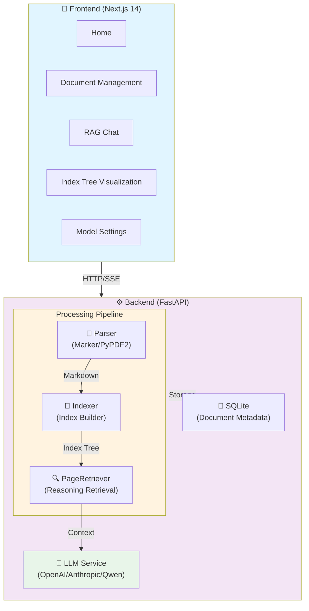

# DocMind — Intelligent Document Q&A

<p align="center">
  
  
  
  
  
</p>

**[中文](README.md) | English**

> 🧠 **DocMind** — An intelligent document Q&A system, enabling AI to read documents like experts. Say goodbye to vector similarity, embrace true relevance.

---

## ✨ Core Features

| Feature | Description |
|---------|-------------|
| 🔮 **Reasoning Retrieval** | Independent of vector similarity, LLM autonomously traverses index tree to reason answers |
| 📑 **Marker High-Quality Parsing** | PDF → Markdown, preserving heading hierarchy, tables, formulas, code blocks |
| 🌳 **Smart Index Tree** | Automatically builds ToC tree from Markdown structure, mimicking human document reading |
| 💬 **RAG Conversation** | Precise Q&A based on document content, supporting streaming output |
| 🤖 **Multi-Model Support** | OpenAI / Anthropic / Qwen / Local models, fully configurable |
| 🎨 **Deep Ocean Theme** | Immersive Deep Ocean UI experience |

---

## 🏗️ System Architecture



---

## 📂 Project Structure

```
docmind/
├── backend/                     # FastAPI Backend
│   ├── app/
│   │   ├── routers/            # API Routes
│   │   │   ├── documents.py    # Document Management API
│   │   │   └── chat.py        # RAG Chat API
│   │   ├── services/          # Core Services ⭐
│   │   │   ├── parser.py      # Document Parsing (Marker / PyPDF2)
│   │   │   ├── indexer.py     # Index Building
│   │   │   └── llm.py         # LLM Service Wrapper
│   │   ├── models/             # SQLAlchemy Models
│   │   └── core/               # Configuration
│   ├── uploads/                # Upload Storage
│   ├── .venv/                 # Python Virtual Environment
│   └── run.py                 # Entry Point
│
└── frontend/                   # Next.js Frontend
    ├── app/
    │   ├── page.tsx            # Home Page
    │   ├── documents/          # Document Management Page
    │   ├── chat/              # RAG Chat Page
    │   ├── index-tree/        # Index Tree Visualization
    │   └── settings/          # Model Configuration
    └── lib/
        └── api.ts            # API Client
```

---

## 🚀 Quick Start

### Requirements

- Python 3.10+
- Node.js 18+
- npm / pnpm

### 1. Clone & Enter Directory

```bash
git clone https://github.com/XiaoBinGan/DocMind.git
cd DocMind
```

### 2. Configure Backend

```bash
cd backend
cp .env.example .env
```

Edit `.env`:

```env
# LLM Provider (openai / anthropic / qwen)
LLM_PROVIDER=openai

# API Keys
OPENAI_API_KEY=sk-your-openai-key
# ANTHROPIC_API_KEY=sk-ant-your-key
# DASHSCOPE_API_KEY=your-dashscope-key

# Model Configuration
MODEL_NAME=gpt-4o-mini
```

### 3. Install Dependencies

```bash
# Backend (recommended to use virtual environment)
cd backend
python -m venv .venv
source .venv/bin/activate        # macOS/Linux
# .venv\Scripts\activate       # Windows

pip install -r requirements.txt

# Frontend
cd ../frontend
npm install
```

### 4. Start Services

```bash
# Terminal 1: Backend (Port 8000)
cd backend
source .venv/bin/activate
python run.py

# Terminal 2: Frontend (Port 3000)
cd frontend
npm run dev
```

### 5. Open Browser

Visit **http://localhost:3000**

---

## 🔧 Configuration

### Supported LLM Providers

| Provider | Environment Variable | Model Examples |
|----------|----------------------|-----------------|
| OpenAI | `OPENAI_API_KEY` | `gpt-4o`, `gpt-4o-mini` |
| Anthropic | `ANTHROPIC_API_KEY` | `claude-3-5-sonnet` |
| Qwen | `DASHSCOPE_API_KEY` | `qwen-plus`, `qwen-max` |

Switch dynamically on the settings page without restarting.

### PDF Parsing Engine

System automatically detects and uses the following engines (by priority):

1. **Marker** — PDF → High-quality Markdown (heading hierarchy, tables, formulas, code blocks)
2. **PyPDF2** — Plain text extraction (fallback)

Marker model auto-downloads on first run (~3GB, cached to `~/Library/Caches/datalab`).

---

## 🧠 Core Principle

### Traditional RAG Limitations

```
Vector Similarity ≠ Semantic Relevance

User Question: "What does Chapter 3 discuss?"
Vector Retrieval → Finds text near "Chapter 3" → Wrong Answer
```

### DocMind Solution

```
Step 1: Build Index Tree
  Markdown Structure → Auto-identify # ## ### Headings
  → Generate ToC Tree (with page ranges)

Step 2: Reasoning Retrieval
  User Question → LLM analyzes needed chapters
  → Traverse index tree, select nodes → Extract context

Step 3: Generate Answer
  Context + Question → LLM → Precise Answer
```

> Core Idea: Mimic human document reading — check table of contents first, then locate content.

---

## 📡 API Documentation

### Document Management

```
POST   /api/documents/upload          Upload Document
GET    /api/documents                List All Documents
GET    /api/documents/{id}          Get Document Details
GET    /api/documents/{id}/index    Get Index Tree
DELETE /api/documents/{id}          Delete Document
POST   /api/documents/{id}/reindex  Rebuild Index
```

### RAG Chat

```
POST   /api/chat                    Send Message (Non-streaming)
POST   /api/chat/stream             Stream Chat (SSE)
GET    /api/conversations           List Conversations
DELETE /api/conversations/{id}      Delete Conversation
```

---

## 🛠️ Extension Development

### Add New Document Format

Edit `backend/app/services/parser.py`:

```python
@staticmethod
async def _parse_xxx(file_path: str) -> dict:
    # 1. Parse file
    # 2. Extract page content
    # 3. Return standardized structure
    return {
        "success": True,
        "page_count": len(pages),
        "pages": [{"page_number": i, "content": "...", "char_count": n}],
        "title": "Document Title",
        "parser": "your_parser"
    }
```

Then add branch in `SUPPORTED_TYPES` and `parse()` method.

### Add New LLM Provider

Edit `backend/app/services/llm.py`, implement `generate()` method.

---

## 📦 Tech Stack

| Layer | Technology |
|-------|------------|
| **Frontend** | Next.js 14, React 18, TypeScript, Tailwind CSS, Zustand |
| **Backend** | FastAPI 0.109, SQLAlchemy, aiosqlite, Pydantic |
| **Document Parsing** | Marker (PDF→Markdown), PyPDF2, python-docx |
| **LLM** | OpenAI SDK, Anthropic SDK, Qwen SDK |
| **Deployment** | Single-machine, Docker support (optional) |

---

## 🔐 Security

### API Authentication & Authorization

- **Environment Variable Isolation**: All API Keys stored in `.env`, not committed to version control
- **Request Validation**: FastAPI uses Pydantic for automatic request validation
- **CORS Configuration**: Frontend cross-origin requests restricted to configured origins

### Data Protection

| Measure | Description |
|---------|-------------|
| **File Upload Limit** | Default 100MB max, configurable in `config.py` |
| **File Type Check** | Only safe formats (PDF, DOCX, TXT, etc.) allowed |
| **Temp File Cleanup** | Auto-delete uploaded temp files after processing |
| **Database Encryption** | SQLite supports SQLCipher encryption (optional) |

### LLM API Security

- **Key Management**: API Keys only used in backend, inaccessible to frontend
- **Request Signing**: Configurable API request signature verification
- **Rate Limiting**: Configurable LLM call frequency limits to prevent abuse
- **Log Sanitization**: Sensitive info (API Keys, user data) not logged

### Deployment Checklist

```bash
# Production Environment Checklist
✅ Use HTTPS (configure SSL certificate)
✅ Enable CORS whitelist
✅ Configure firewall rules
✅ Regularly update dependencies (pip audit)
✅ Enable database backups
✅ Configure logging and alerting
✅ Use reverse proxy (Nginx)
✅ Enable rate limiting middleware
```

### Dependency Security

```bash
# Check for known vulnerabilities
pip install pip-audit
pip-audit

# Regularly update dependencies
pip install --upgrade -r requirements.txt
```

---

## ⚠️ FAQ

**Q: PDF parsing fails?**  
A: Ensure Marker model is downloaded, or check if PDF is scanned (requires OCR).

**Q: Model call returns 401?**  
A: Check if API Key in `.env` is correct and not expired.

**Q: Large file upload timeout?**  
A: Modify `UPLOAD_MAX_SIZE` in `backend/app/core/config.py` and uvicorn timeout settings.

---

## 🤝 Contributing Guide

DocMind is an open-source project welcoming all forms of contribution! Whether you're a developer, designer, documentation writer, or user, you can help improve this project.

### How to Contribute

#### 1. Report Bugs 🐛

Found an issue? Submit it on [GitHub Issues](https://github.com/XiaoBinGan/DocMind/issues):

```markdown
**Problem Description**
Clear and concise description of the bug

**Reproduction Steps**
1. Open...
2. Click...
3. See error...

**Expected Behavior**
What should happen

**Actual Behavior**
What actually happened

**Environment Info**
- OS: [e.g. macOS 14.0]
- Python: [e.g. 3.11]
- Node.js: [e.g. 18.0]
```

#### 2. Submit Feature Suggestions 💡

Have a great idea? Discuss it on [Discussions](https://github.com/XiaoBinGan/DocMind/discussions) or submit an Issue.

#### 3. Submit Pull Request 🚀

```bash
# 1. Fork project
git clone https://github.com/YOUR_USERNAME/DocMind.git
cd DocMind

# 2. Create feature branch
git checkout -b feature/amazing-feature

# 3. Commit changes
git add .
git commit -m "feat: add some feature"

# 4. Push to branch
git push origin feature/amazing-feature

# 5. Open Pull Request
```

**PR Submission Standards**:
- Use [Conventional Commits](https://www.conventionalcommits.org/) format
- One PR does one thing
- Include clear description and related Issue links
- Ensure all tests pass

### Contribution Areas

We especially welcome contributions in these areas:

| Area | Requirements | Difficulty |
|------|--------------|-----------|
| **Backend Development** | New LLM providers, index algorithm optimization, performance improvement | ⭐⭐⭐ |
| **Frontend Development** | UI/UX improvement, new pages, responsive design | ⭐⭐ |
| **Documentation** | Chinese/English docs, API docs, tutorials | ⭐ |
| **Testing** | Unit tests, integration tests, E2E tests | ⭐⭐ |
| **DevOps** | Docker config, CI/CD pipeline, deployment scripts | ⭐⭐⭐ |
| **Translation** | i18n support, multilingual docs | ⭐ |
| **Design** | UI themes, icons, brand assets | ⭐⭐ |

---

## 👥 Recruiting Maintainers

DocMind is looking for passionate open-source contributors to join the core maintenance team!

### We're Looking For

#### 🔧 **Backend Engineers**
- Proficient in Python, FastAPI, SQLAlchemy
- Interested in RAG and LLM applications
- Capable of independent feature development and optimization

**Responsibilities**:
- Maintain and improve core algorithms
- Integrate new LLM providers
- Performance optimization and bug fixes
- Code review

#### 🎨 **Frontend Engineers**
- Proficient in React, Next.js, TypeScript
- UI/UX design awareness
- Focus on user experience and code quality

**Responsibilities**:
- Develop new features and pages
- Optimize user interface
- Performance optimization
- Cross-browser compatibility testing

#### 📚 **Technical Documentation Writers**
- Clear communication skills
- Familiar with Markdown and technical writing
- Ability to simplify complex concepts

**Responsibilities**:
- Write and maintain documentation
- Create tutorials and examples
- Internationalization translation
- API documentation maintenance

#### 🧪 **QA Engineers**
- Attention to detail, testing mindset
- Familiar with automated testing frameworks
- Ability to write clear bug reports

**Responsibilities**:
- Functional and regression testing
- Write test cases
- Performance testing
- Collect user feedback

#### 🚀 **DevOps Engineers**
- Familiar with Docker, Kubernetes
- CI/CD pipeline design experience
- Cloud platform deployment experience

**Responsibilities**:
- Build CI/CD pipeline
- Docker image optimization
- Write deployment scripts
- Infrastructure maintenance

### How to Join

1. **Star ⭐ the Project on GitHub**
   - Show your support and interest

2. **Participate in Discussions and Issues**
   - Share ideas on [Discussions](https://github.com/XiaoBinGan/DocMind/discussions)
   - Answer other users' questions

3. **Submit Pull Requests**
   - Start with small improvements
   - Showcase your code quality and ability

### Maintainer Benefits

✨ **Get the following benefits**:
- 🏆 Recognition in README
- 📊 Access to project statistics and analytics
- 🎯 Participate in project direction decisions
- 💬 Priority technical support
- 🎁 Regular community rewards and recognition
- 📈 Build personal open-source influence

### Code of Conduct

We're committed to providing a friendly and inclusive environment for all contributors. Please follow our [Code of Conduct](CODE_OF_CONDUCT.md):

- ✅ Respect all contributors
- ✅ Constructive feedback
- ✅ Accept different perspectives
- ✅ Focus on project goals
- ❌ No harassment, discrimination, or hate speech

---

## 📄 License

MIT License — See [LICENSE](LICENSE) for details

---

<p align="center">
  <em>DocMind — Let AI read documents like experts</em>
</p>
